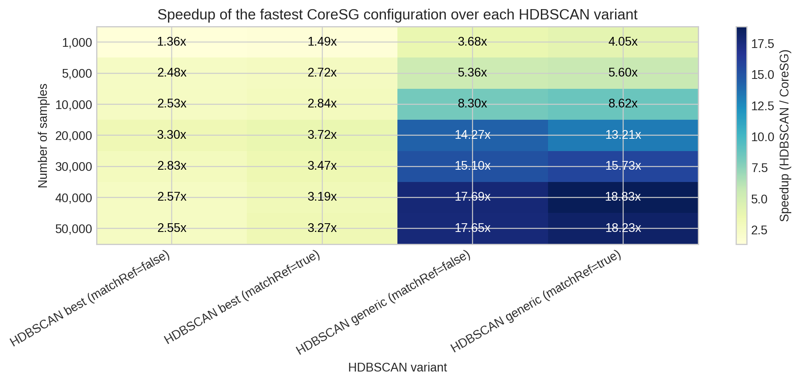

Interpreting Benchmark Results
==============================

Interpret Core-SG results in terms of total analysis cost.

If a workflow needs one clustering result, the Core-SG build cost may not be
worth paying. If the workflow needs many ``k`` values over the same ``X``, the
one-time build can be amortized by extraction reuse.

PyNNDescent and Score-SG results may show warm-up effects. Treat first-run
timings carefully and prefer repeated measurements when reporting results.
