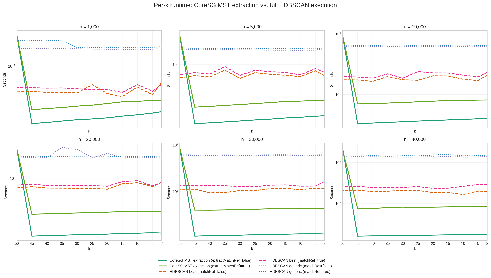

Runtime Comparison
==================

.. image:: ../_static/images/benchmarks/cumulative_runtime_by_samples.png
   :alt: Cumulative runtime by sample size

The cumulative view is the primary performance view for Core-SG because it
charges the build step once and then sums repeated extraction work.

The per-``k`` view is useful for seeing the initial build cost and the much
smaller extraction costs that follow.
